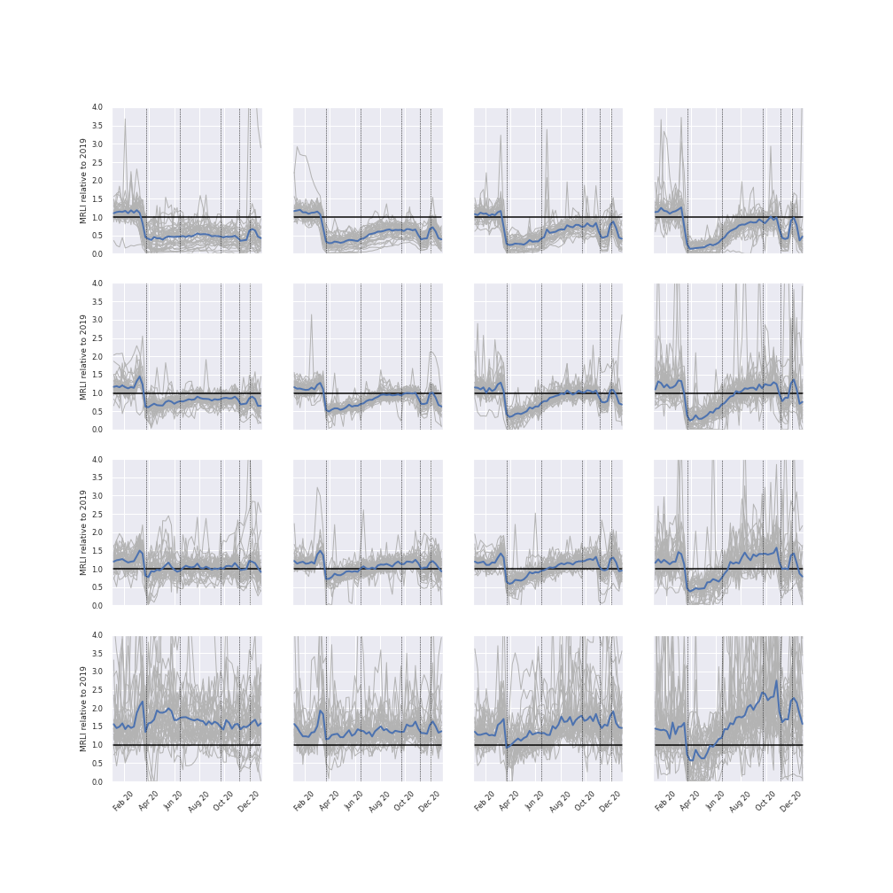

<div align="center">
  
  
  # London High Streets
  ### Analysis and Modeling of London High Street Profiles
  
  [](https://github.com/psf/black)
  [](https://www.python.org/downloads/)
  [](https://opensource.org/licenses/MIT)
</div>

<p align="center">
  <a href="#overview">Overview</a> •
  <a href="#key-features">Key Features</a> •
  <a href="#installation">Installation</a> •
  <a href="#usage">Usage</a> •
  <a href="#documentation">Documentation</a> •
  <a href="#contributing">Contributing</a> •
  <a href="#contact">Contact</a>
</p>

## Overview

The London High Streets package is a comprehensive Python toolkit for processing, analyzing, and managing footfall and transaction data across London's high streets, town centers, and business improvement districts (BIDs). This project supports evidence-based decision-making for urban planning and economic development in London.

## Key Features

🔄 **Data Integration**
- BT footfall sensor data processing
- Mastercard transaction data analysis
- Multi-level geographic data integration
- Temporal and spatial aggregations

📊 **Analytics & Metrics**
- Footfall patterns and trends
- Transaction volume analysis
- Visitor demographics and behavior
- Economic performance indicators

🗺️ **Geographic Processing**
- Hex grid data management (350m/400m)
- Administrative boundary integration
- Spatial analysis and mapping
- GIS data compatibility

🔍 **Quality Assurance**
- Automated data validation
- Schema enforcement
- Outage detection
- Missing data handling

## Installation

### Prerequisites
- [Git](https://git-scm.com)
- [Poetry](https://python-poetry.org/docs/master/#installing-with-the-official-installer)
- Python 3.8+

### Setup

```bash
# Clone the repository
git clone https://github.com/Greater-London-Authority/highstreets

# Navigate to project directory
cd highstreets

# Install dependencies
poetry install

# Activate virtual environment
poetry shell
```

### Environment Configuration

Create a `.env` file with the following credentials:
```env
# Database
POSTGRES_USER=your_username
POSTGRES_PASSWORD=your_password
POSTGRES_HOST=your_host
POSTGRES_DB=your_database

# AWS
AWS_ACCESS_KEY_ID=your_access_key
AWS_SECRET_ACCESS_KEY=your_secret_key
AWS_REGION=your_region

# API Keys
API_KEY=your_api_key
```

# Highstreets Package

A Python package for processing, analyzing and managing footfall and transaction data for London's high streets, town centers, and business improvement districts (BIDs).

## Core Functionality

### 1. Data Processing & Integration

- Processes footfall data from BT sensors
- Handles transaction data from Mastercard 
- Integrates data for:
  - High streets
  - Town centers
  - Business Improvement Districts (BIDs)
  - Custom/bespoke areas
  - Inner/Outer London regions
  - MSOAs (Middle Super Output Areas)
  - LSOAs (Lower Super Output Areas)

### 2. Data Transformations

- Performs temporal aggregations:
  - 3-hourly counts
  - Daily aggregates
  - Weekly summaries
- Handles spatial aggregations across different geographic units
- Applies inflation adjustments to transaction data
- Calculates year-over-year growth metrics

### 3. Data Quality & Validation

- Schema validation for different data types
- Data type enforcement and conversion
- Handling of missing values
- Date range validation
- Outage detection and tracking

### 4. Geographic Processing

- Processes hex grid data (350m and 400m grids)
- Spatial joins with various administrative boundaries
- Creation and maintenance of geographic lookups
- Integration with GIS data

### 5. Data Storage & Distribution

- PostgreSQL database integration
- S3 bucket storage management
- CSV file generation and management
- API integration for data retrieval
- London Datastore integration for public data sharing

## Key Components

### Data Sources
- BT footfall data
- Mastercard transaction data
- Geographic boundary data
- CPI (Consumer Price Index) data

### Geographic Units
- High streets
- Town centers
- Business Improvement Districts
- Bespoke areas
- MSOAs/LSOAs
- Inner/Outer London

### Metrics
- Footfall counts
- Transaction amounts
- Transaction counts
- Visitor types (residents, workers, international visitors)
- Dwell time
- Loyalty percentages

## Technical Features

### AWS Integration
- S3 storage management
- Pipeline automation
- Data versioning

### Database Management
- PostgreSQL integration
- Table creation and maintenance
- Data append and update operations
- Change tracking

### API Integration
- Data retrieval from external APIs
- OAuth authentication handling
- Rate limiting and error handling

### Data Export
- CSV generation
- London Datastore uploads
- Custom data formats for partners

## Use Cases

1. Economic Analysis
   - Retail performance monitoring
   - Visitor behavior analysis
   - Economic impact assessment

2. Urban Planning
   - High street performance tracking
   - Visitor flow analysis
   - Area comparison studies

3. Business Intelligence
   - Footfall trends
   - Transaction patterns
   - International visitor tracking

4. Policy Making
   - Evidence-based decision support
   - Impact assessment
   - Performance monitoring

## Dependencies

- pandas
- geopandas
- numpy
- sqlalchemy
- psycopg2
- boto3
- requests
- fsspec

## Environment Setup

Requires environment variables for:
- PostgreSQL credentials
- AWS credentials
- API authentication
- File path configurations


## Contribute
[(Back to top)](#how-to-use)

Contact Anupam Bose to be added to the repo as a contributor.

If you are contributing to the repo please use pre-commit using the pre-commit-config.yaml included here.

To install pre-commit run:
```bash
pip install pre-commit
```

Then to set up the git hooks specified in the pre-commit-config.yaml file navigate to the repo and run:
```bash
pre-commit install
```

Now when you commit code various linters and other pre-commit checks will be run against your staged changes. All of these tests have to pass sucessfully before the commit will be accepted.


## Contact
[(Back to top)](#v)

Anupam Bose - anupam.bose@london.gov.uk
